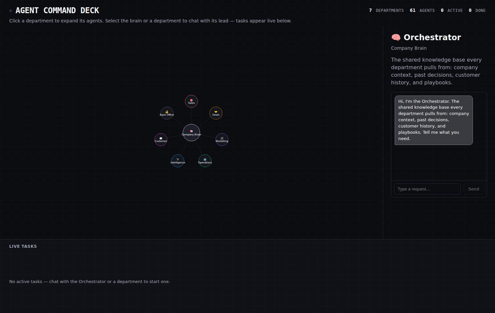
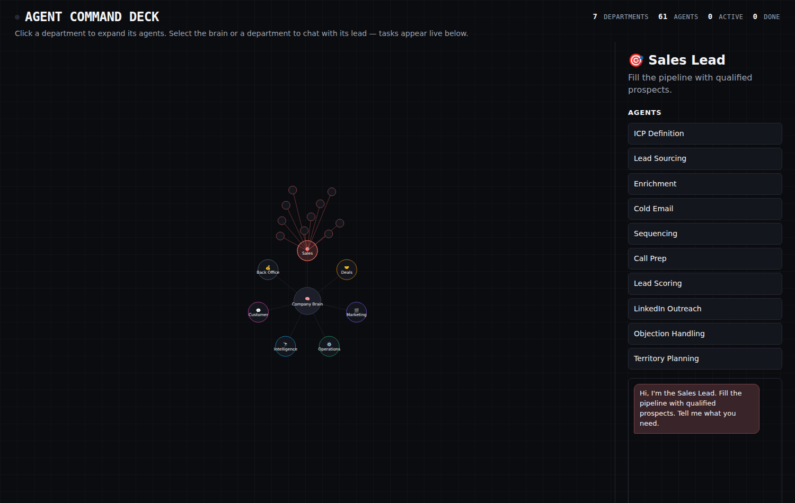
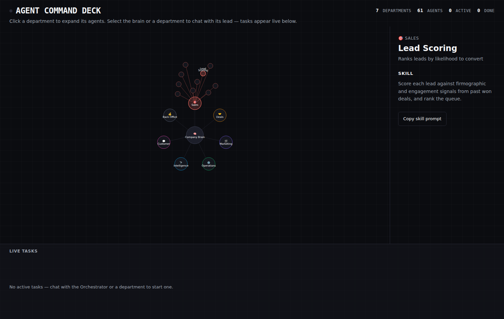
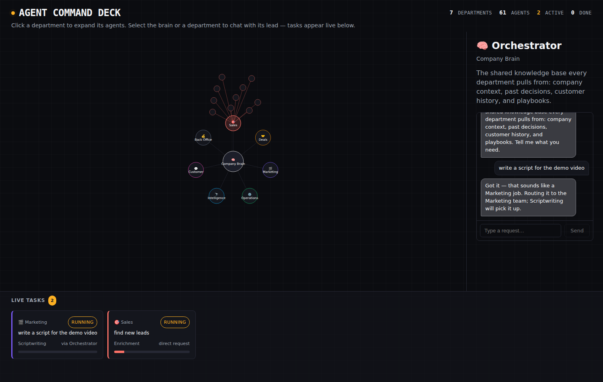

# Agent Command Deck

A single-screen mission-control view of an AI-run company: a central
knowledge base ("Company Brain") with 7 departments branching off it, each
containing the agents that make up its workflow. The map, the chat, and a
live feed of every task in flight are all visible at once — nothing is
tucked behind a tab.

Departments: Sales, Deals, Marketing, Operations, Intelligence, Customer, and
Back Office — each modeled as a chain of narrow, composable agent skills
rather than one do-everything bot.

Three things you can do:

- **Browse the map.** Click a department to expand its agents; click an
  agent to see its role and the skill (prompt) it runs.
- **Chat with a team lead or the Orchestrator.** Select the Company Brain
  (the Orchestrator) or any department and a chat box appears. Describe what
  you need in plain language; the Orchestrator figures out which department
  owns it and routes it, a department lead picks the right agent on its own
  team. This runs entirely client-side via lightweight keyword matching
  (`src/lib/orchestrate.ts`) — there's no LLM wired in, so treat it as a
  routing simulation, not a real assistant.
- **Watch tasks progress.** Every routed request becomes a task with a
  simulated progress bar, ticking up over a few seconds until it completes —
  visible live in the task feed along the bottom of the screen the whole
  time, updating in the background no matter what else you're doing on the
  map.

## Screenshots

| Overview | Department expanded | Agent detail |
| --- | --- | --- |
|  |  |  |

| Command deck in action |
| --- |
|  |

## Structure

- `src/data/company.ts` — the data model: departments and their agents, each
  agent with a `role` and a `skill` (the prompt/runbook it executes). This is
  the file to edit to add departments or agents.
- `src/lib/orchestrate.ts` — simulated routing: matches a chat message to a
  department/agent by keyword overlap and produces a reply plus a task.
- `src/components/ChatPanel.tsx` — the chat UI for talking to a team lead or
  the Orchestrator.
- `src/components/TasksBoard.tsx` — the task-progress cards, rendered either
  as a grid or as the compact horizontal feed strip (`variant` prop).
- `src/App.tsx` — renders the radial map (SVG), the detail/chat panel, the
  header's live stats, and the persistent task feed — all in one layout.

## Development

```sh
npm install
npm run dev
```

## Build

```sh
npm run build
npm run preview
```
